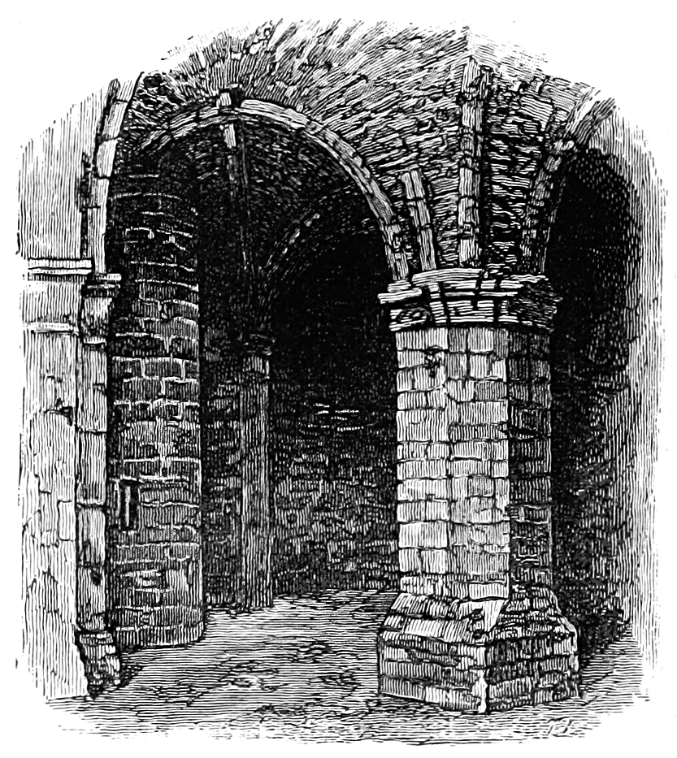

<section class="gtr">

<h1>Welcome to Dungeons of Olde!</h1>

Before you is <em>Dungeons of Olde</em>, a versatile tabletop roleplaying game that opens a door into any fantastic world you can imagine. You can play it as an open-ended, old school dungeon-crawler; an extra-crunchy, classic-era campaigner; or a modern, rules-light story-teller. You can play it as a traditional, game-mastered RPG; a solo or cooperative questing board game; or a head-to-head skirmisher pitting two or more player-controlled forces against one another. This website provides rules and additional resources to facilitate all these styles of play.

<h2>
  <a href="{{site.baseurl}}/rules/" title="Go to the DoO Rules">Rules</a>
</h2>

The basic <em>Dungeons of Olde</em> mechanics can support a wide variety of RPG formats, though at its most basic level, the game plays as an old-school dungeon crawl run by a traditional gamemaster. Additional rules and conventions are (or will be) provided to adapt the game for other styles of play, and can be mixed and matched to suit the tastes of the players around the table. Here are some of the options that are (or will be) available:

The <a href="{{site.baseurl}}/core-rules/">Core Rules</a> hones the game down to its key mechanics, and relies on a Game Master or pre-generated scenario to make common-sense rulings for special circumstances during play. In the Core version of <em>Dungeons of Olde</em>, you can create a character in five minutes or less&mdash;just pick a Stat Array and assign the numbers to your Primary Stats, choose a Skill Package to suit the role you want to play, gear up, and set out for adventure.

The <strong>Crunchy Characters</strong> option adds a "classless," point-based character creation system that lets you design unique characters with a high degree of granularity. Crunchy Characters will work alongside Core Rules characters, so if one player wants to customize his character while the rest of the party prefers to keep it simple, <em>Dungeons of Olde</em> can handle both approaches at once.

The <strong>Custom Conjuring</strong> rules toss out rigid spell lists and allows characters with arcane inclinations to design their own spells and rituals, or to bend the elements to their will however the situation demands. As with Crunchy Characters, <em>Dungeons of Olde</em> can handle Core casters and Custom Conjurers in the same adventuring party.

The <strong>Action Allocation</strong> system adds a rich but intuitive maneuver system to <em>Dungeons of Olde</em> combat, accentuating the differences between Stat builds and Skill choices, and emphasizing tactical decisions.

The <strong>Deus est Machina</strong> option lets you play <em>Dungeons of Olde</em> without a human gamemaster, allowing solo players and teams to explore random, semi-random, or pre-programmed scenarios. (Yes, I know that means "God <em>is</em> the machine." Think about it.)

The <strong>Miniature Mayhem</strong> rules let players face off in small-force skirmishes, providing guidelines on designing scenarios and balancing forces for fair fights.

The <strong>As-Yet-Unnamed Narrative Option</strong> offers guidelines on playing <em>Dungeons of Olde</em> as a modern collaborative storytelling game, moving the action off the tabletop and into the shared imaginings of the players and their game master.

<h2>
  <a href="{{site.baseurl}}/resources/" title="Enhance your game with DoO Resources">Resources</a>
</h2>
In the Resources section, you'll find a variety of play aids to enhance your <em>Dungeons of Olde</em> gaming. Our 2.5d printable papercraft tile system is already available. Plans for additional resources include:

<ul class="bulleted">
  <li>Reference material, including a monster cyclopedia, a catalog of adventuring gear, game-mastering guidelines, and printable reference sheets.</li>
  <li>Printable game components intended principally for "Deus est Machina" play (without a GM), including character, loot, spell and skill cards, as well as tracking tokens.</li>
  <li><em><a href="{{site.baseurl}}/resources/miniatures/" title="Check out the Dungeons of Olde papercraft miniatures!">Dungeons of Olde Terrain Tiles</a></em>, a complete system of geomorphic papercraft 2.5D dungeon terrain, offered in PDF format for home printing.</li>
</ul>

As the rule system stabilizes through playtest, we'll begin to post PDF versions of the complete rules in the Resources section for convenient printing. In the meantime, all the pages in the Rules section have special print-only formatting, so you can print each page directly from the browser by right-clicking the page and selecting the Print option. Printing the rules directly from the website assures that you are always printing the very latest iteration of the game.

<h2>
  <a href="{{site.baseurl}}/blog/" title="Follow our progress in the DoO Blog">Blog</a>
</h2>

The <em>Dungeons of Olde</em> blog traces my thinking as both the game and the website progress. I'll blog about my design decisions and the philosophy and priorities underlying them, and respond to input from whatever player community develops. I'll also write about the technology underlying the <em>Dungeons of Olde</em> website, since the project began at least in part as an excuse to learn the <a href="http://jekyllrb.com/" target="_blank" title="Discover Jekyll">Jekyll static site generator</a>. I'll continue to improve the site's code as well as its content, and the blog will be where I tell you <em>why</em> I did whatever I did. And finally, I may muse on topics related to tabletop roleplaying as well as fantasy and science fiction literature, both in print and on screen. In fairness, the blog is likely to be the least active section of the <em>Dungeons of Olde</em> website, but additions there will be at least easy to find.

</section>
